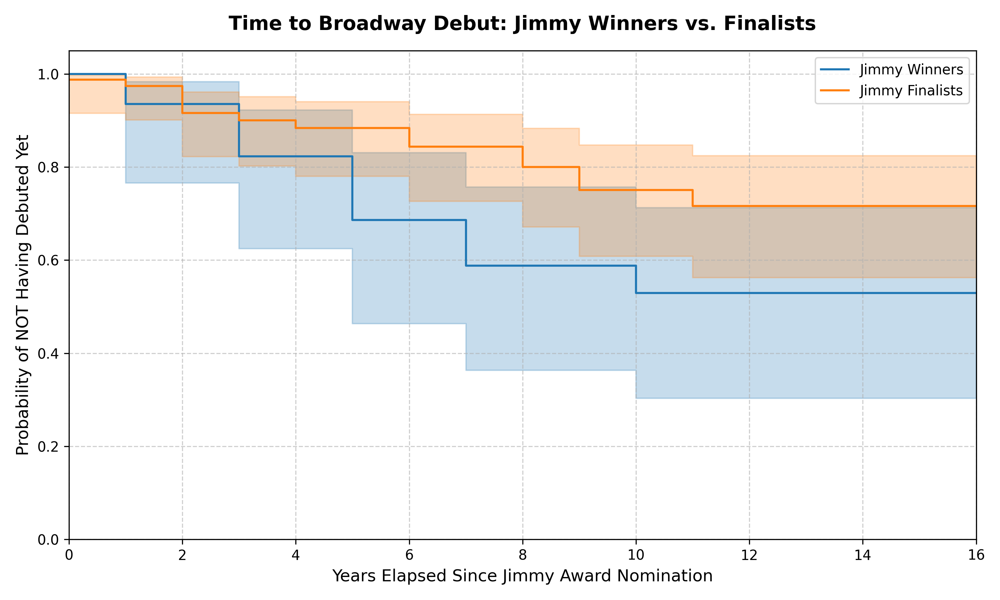

# Modeling Broadway Trajectories: A Statistical Analysis of Early-Career Musical Theatre Signals

A quantitative study examining whether recognition from the National High School Musical Theatre Awards (The Jimmy Awards) is associated with accelerated Broadway entry and long-term career outcomes.

## Executive Summary

This project evaluates the predictive relationship between an early-career artistic credential and subsequent professional outcomes using survival analysis and count-data modelling on a manually curated 16-year historical panel dataset ($N=113$).

The central research question is:

> Does Jimmy Award recognition contain measurable information about future Broadway career trajectories, or do finalist-level selection effects explain most observed differences?

This project treats awards as an early-career signalling mechanism: an observable credential that may contain predictive information about future outcomes, analogous to signal evaluation problems studied in labour economics and financial decision-making.

Key findings:

* **Broadway Entry Timing:** A multivariate **Cox Proportional Hazards Model** estimates that Jimmy Award winners enter Broadway at approximately twice the rate of finalists at any given point in time (Hazard Ratio = 2.04). The estimate is directionally large but accompanied by uncertainty due to the limited sample size ($p = 0.0709$).

* **Cumulative Broadway Credits:** A **Poisson Regression Model** finds that Jimmy Award winners have higher cumulative Broadway credit counts after controlling for available demographic variables ($p = 0.010$), with an estimated 2.31x multiplier relative to finalists.

These findings should be interpreted as associations rather than causal effects. The analysis investigates whether award recognition is predictive of observed career outcomes, not whether winning independently causes career advancement.

---

## Research Questions

This project investigates three related questions:

1. Does Jimmy Award recognition predict faster transition into Broadway employment?

2. Conditional on entering Broadway, is recognition associated with greater accumulation of Broadway credits?

3. How effectively can a single early-career credential function as a signal of future professional outcomes within a highly selective creative industry?

---

## Data Architecture & Bias Mitigation

The dataset tracks Jimmy Award nominees from 2010 to 2026. Data was manually curated and structured using reproducible empirical research practices, with explicit controls for temporal leakage and sample construction bias.

### 1. Broadway Entry Definition

Only official Broadway production contracts recorded by the Internet Broadway Database (IBDB) trigger a debut event.

National Tours, West End productions, and Off-Broadway performances are excluded to isolate Broadway as the highest institutional threshold.

### 2. Look-Ahead Bias Prevention

Future casting announcements for productions that have not officially opened are excluded to prevent future information from entering historical observations.

### 3. Sample Construction

Multi-year nominees are tracked from their baseline nomination year to maintain consistent observation periods and minimise data leakage.

---

## Methodology & Key Findings

## 1. Speed to Broadway Entry (Survival Analysis)

A Kaplan-Meier estimator and multivariate Cox Proportional Hazards Model are used to analyse time from initial Jimmy Award nomination to official Broadway debut.



```python
cph.fit(
    regression_df,
    duration_col='Timeline_Years',
    event_col='Broadway_Debut'
)
```

The estimated hazard ratio suggests that winners enter Broadway at approximately twice the rate of finalists during the observation period (HR = 2.04).

The effect estimate is large, although statistical uncertainty remains due to the small cohort size. Additional observations would be required to determine whether this relationship remains robust across broader samples.

---

## 2. Cumulative Broadway Career Volume (Count Modelling)

To examine longer-term Broadway outcomes, a Poisson Regression Model is applied to cumulative Broadway credit counts.

The model finds that Jimmy Award winners have higher observed Broadway credit volume relative to finalists ($p = 0.010$).

The estimated coefficient corresponds to approximately a 2.31x multiplier in cumulative Broadway credits, suggesting that award recognition is associated with stronger long-term Broadway persistence within this dataset.

---

## Technical Stack

**Language:** Python 3.14

**Core Libraries:**

* `lifelines` — Cox Proportional Hazards and Kaplan-Meier estimation
* `statsmodels` — Poisson regression modelling
* `pandas` — data processing and panel construction
* `matplotlib` — visualisation

---

## Reproducibility

Install dependencies:

```bash
pip install -r requirements.txt
```

Run the analysis pipeline:

```bash
python main.py
```

The pipeline generates the cleaned dataset, statistical models, and visual outputs used throughout the analysis.

---

## Model Limitations & Quantitative Edge Cases

While the models provide useful aggregate insights, artistic careers are complex and cannot be fully represented through Broadway-based metrics alone.

### 1. Small Sample Size

The Jimmy Awards represent a highly selective cohort with only 16 years of available history. The limited sample size restricts statistical power and increases uncertainty around estimated relationships.

### 2. Multi-Hyphenate Career Paths

The model focuses primarily on Broadway outcomes and does not fully capture success outside the Broadway ecosystem.

For example, Renée Rapp (2018 Winner) transitioned from Broadway into major music and film opportunities. A Broadway-credit-only metric records her as having one Broadway credit, failing to capture broader commercial success.

### 3. Credit Volume vs. Career Stability

Using cumulative Broadway credits as an outcome measure introduces limitations.

A performer who remains with a successful production for many years may receive the same credit count as someone whose production closed quickly, despite very different career outcomes. For example, Tony Moreno (2017 Winner) has worked continuously on The Book of Mormon on Broadway from 2022 to present. The dataset presents him as having one Broadway credit, failing to recognise sustained work at a high level.

### 4. Alternative Professional Markets

The analysis intentionally focuses on Broadway as an institutional benchmark. This excludes important career pathways including Off-Broadway development, West End theatre, and national tours. For example, Anna Zavelson (2022 Finalist) has one Broadway credit, but has worked consistently, with her most prestigious credit arguably being Christine Daae in Phantom of the Opera on the West End, which has been excluded in this dataset.

These exclusions create a trade-off: a narrower but more consistent measurement framework.

---

## Conclusion

This project demonstrates how quantitative econometric methods can be applied to complex, highly qualitative industries.

By analysing both **career entry timing** and **cumulative Broadway participation**, the data suggests:

1. Jimmy Award winners and finalists both face significant barriers entering Broadway, with winner status alone not eliminating the competitive nature of the industry.

2. Winner status is associated with higher long-term Broadway credit accumulation, suggesting that early-career recognition may function as a persistent professional signal.

Ultimately, early-career accolades appear less like an immediate career guarantee and more like one observable indicator within a broader ecosystem of talent, timing, networks, and opportunity.
